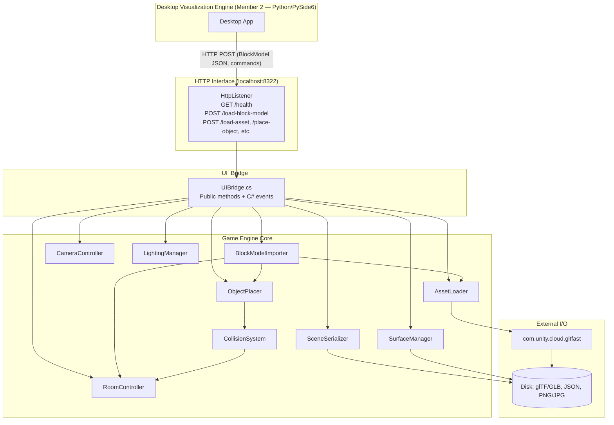

# Design Document: 3D Room Visualizer

## Overview

The 3D Room Visualizer is a Unity (C#) desktop application that lets DIY users design and furnish a virtual room in real time. Users define room dimensions, place and manipulate 3D furniture models, customise surface materials and lighting, and import scanned real-world objects as glTF/GLB assets produced by a companion AI Vision tool.

The system is decomposed into discrete subsystems — Asset_Loader, Object_Placer, Camera_Controller, Surface_Manager, Lighting_Manager, Scene_Serializer, Collision_System, BlockModel_Importer, and HTTP_Listener — each with a well-defined responsibility. A UI_Bridge interface decouples the game-engine mechanics from the Desktop Visualization Engine (Member 2's Python/PySide6 app), allowing parallel development.

**Team integration context:**

The Visualizer is the 3D rendering engine for the Room Vision AI system. The Desktop Visualization Engine (Member 2) drives it via a local HTTP interface on `localhost:8322`. The AI Pipeline (Member 3) produces `BlockModel` JSON on `localhost:8321`, which the Desktop app forwards to the Visualizer via `POST /load-block-model`. This keeps all three subsystems independently deployable and testable.

```
Mobile App  →  [Bluetooth]  →  Desktop Visualization Engine (Python, port 8321 consumer)
                                        │
                                        │  POST /load-block-model (BlockModel JSON)
                                        │  POST /place-object, /set-surface, etc.
                                        ▼
                              Unity Visualizer (this app, localhost:8322)
                                        │
                                        │  reads glTF/GLB assets from disk
                                        ▼
                                   Local Disk
```

**Key design decisions:**

- **Unity 2022 LTS** as the target engine version for stability and long-term support.
- **`com.unity.cloud.gltfast` (v6.x)** as the official Unity-supported package for runtime glTF/GLB import, using async/await patterns.
- **ScriptableObject-based configuration** for room and lighting parameters to support easy serialisation and editor tooling.
- **JSON serialisation via `Newtonsoft.Json` (Json.NET for Unity)** for scene save/load and BlockModel parsing, providing human-readable files and robust round-trip fidelity.
- **`System.Net.HttpListener`** (built into .NET/Mono) for the embedded HTTP server — no third-party dependency required, non-blocking via a background thread.
- **FsCheck + NUnit** for property-based testing of pure logic layers (validation, serialisation, collision, rotation math).
- **Interface-driven subsystem design** so each subsystem can be mocked independently in tests.

---

## Architecture

The application follows a layered architecture with clear separation between the game-engine core, the UI bridge, and external I/O.



**Data flow — AI Pipeline result populates the scene:**

1. Desktop Visualization Engine receives `BlockModel` JSON from AI Pipeline (`localhost:8321`)
2. Desktop app sends `POST /load-block-model` to Visualizer (`localhost:8322`) with the `BlockModel` JSON body
3. `HttpListener` deserialises the JSON and calls `UIBridge.LoadBlockModel(blockModelJson)`
4. `UIBridge` delegates to `BlockModelImporter.ImportAsync(blockModel)`
5. `BlockModelImporter` calls `RoomController.SetDimensions` from `room_dimensions`
6. For each block, `BlockModelImporter` resolves a glTF asset (or default primitive) and calls `ObjectPlacer.PlaceObject`
7. `UIBridge` raises `OnOperationComplete(OperationResult)` event; `HttpListener` returns the result as JSON

**Data flow for a typical user action (e.g., place object):**

1. Desktop app calls `POST /place-object` on `localhost:8322`
2. `HttpListener` calls `UIBridge.PlaceObject(assetRef, position)`
3. `UIBridge` delegates to `ObjectPlacer.PlaceObject(assetRef, position)`
4. `ObjectPlacer` queries `CollisionSystem.WouldCollide(bounds, position)`
5. If clear, `ObjectPlacer` instantiates the object and updates the scene graph
6. `UIBridge` raises `OnOperationComplete(OperationResult)` event
7. `HttpListener` returns the `OperationResult` as the HTTP response body

---

## Components and Interfaces

### IRoomController

```csharp
public interface IRoomController
{
    Vector3 Dimensions { get; }
    bool SetDimensions(float width, float depth, float height);
    Bounds GetRoomBounds();
    GameObject GetSurface(SurfaceId surfaceId);
}
```

`RoomController` owns the room geometry (walls, floor, ceiling as child GameObjects). `SetDimensions` validates the [1, 50] metre range and returns `false` on rejection, raising a `OnValidationError` event with a message.

### IAssetLoader

```csharp
public interface IAssetLoader
{
    Task<LoadResult> LoadGltfAsync(string filePath);
    event Action<LoadResult> OnLoadComplete;
}
```

`AssetLoader` wraps `com.unity.cloud.gltfast`'s `GltfImport` class. It validates the file extension before attempting load, handles missing-texture fallback by substituting a default material, and enforces the 5-second timeout via `CancellationToken`. `LoadResult` carries the instantiated `GameObject` (or null on failure) and an error message.

### IObjectPlacer

```csharp
public interface IObjectPlacer
{
    void BeginPlacement(GameObject prefab);
    PlacementResult ConfirmPlacement(Vector3 cursorWorldPos);
    void SelectObject(GameObject obj);
    void MoveObject(GameObject obj, Vector3 delta);
    void RotateObject(GameObject obj, int steps);
    void RemoveObject(GameObject obj);
    IReadOnlyList<GameObject> PlacedObjects { get; }
}
```

`RotateObject` applies `steps * 15f` degrees around the Y axis. `ConfirmPlacement` calls `CollisionSystem.WouldCollide` before placing; on collision it sets a `IsColliding` flag and returns `PlacementResult.Blocked`. `MoveObject` constrains movement to the XZ plane (floor plane).

### ICameraController

```csharp
public interface ICameraController
{
    void Translate(Vector2 input);
    void Orbit(Vector2 mouseDelta);
    void Zoom(float scrollDelta);
    void ToggleTopDownView();
    float DistanceFromCenter { get; }
}
```

`Zoom` clamps `DistanceFromCenter` to [1, 20] metres. `Translate` and `Orbit` clamp the resulting camera position to the room bounding volume. `ToggleTopDownView` switches between `ProjectionType.Perspective` and `ProjectionType.Orthographic`.

### ISurfaceManager

```csharp
public interface ISurfaceManager
{
    void SetSurfaceColor(SurfaceId surfaceId, Color color);
    Task<bool> SetSurfaceTextureAsync(SurfaceId surfaceId, string filePath);
    Material GetSurfaceMaterial(SurfaceId surfaceId);
}

public enum SurfaceId { WallNorth, WallSouth, WallEast, WallWest, Floor, Ceiling }
```

Each `SurfaceId` maps to a distinct `Material` instance. `SetSurfaceTextureAsync` checks file size before loading; files exceeding 10 MB raise `OnValidationError` and return `false`. Texture tiling is applied via `material.mainTextureScale`.

### ILightingManager

```csharp
public interface ILightingManager
{
    void SetAmbientIntensity(float intensity);
    bool AddPointLight(Vector3 position, Color color, float intensity);
    void RemovePointLight(int index);
    int PointLightCount { get; }
}
```

`AddPointLight` returns `false` if `PointLightCount >= 4`. Ambient intensity maps directly to `RenderSettings.ambientIntensity`.

### ISceneSerializer

```csharp
public interface ISceneSerializer
{
    Task<bool> SaveAsync(string filePath, SceneData data);
    Task<LoadSceneResult> LoadAsync(string filePath);
}
```

`SceneData` is a plain C# data class (no Unity types) serialised to JSON. `LoadAsync` returns a `LoadSceneResult` containing the restored `SceneData` and a list of `MissingAssetWarning` entries for any referenced glTF/GLB files not found on disk.

### ICollisionSystem

```csharp
public interface ICollisionSystem
{
    bool WouldCollide(Bounds objectBounds, Vector3 proposedPosition);
    bool IsWithinRoomBounds(Bounds objectBounds, Vector3 position);
}
```

Uses Unity `Physics.OverlapBox` for overlap detection and compares against `IRoomController.GetRoomBounds()` for boundary checks.

### UIBridge

```csharp
public class UIBridge : MonoBehaviour
{
    // Actions
    public void LoadAsset(string filePath) { ... }
    public void PlaceObject(string assetRef, Vector3 position) { ... }
    public void MoveObject(string objectId, Vector3 delta) { ... }
    public void RotateObject(string objectId, int steps) { ... }
    public void RemoveObject(string objectId) { ... }
    public void SetSurfaceMaterial(SurfaceId surfaceId, MaterialParams p) { ... }
    public void SetLightingParameter(LightingParams p) { ... }
    public void SaveScene(string filePath) { ... }
    public void LoadScene(string filePath) { ... }
    public void LoadBlockModel(string blockModelJson) { ... }  // NEW — team integration

    // Events
    public event Action<OperationResult> OnOperationComplete;
}
```

`OperationResult` carries `bool Success`, `string OperationName`, `string Message`, and an optional `object Payload`. All public methods are non-blocking; async operations complete via the event.

---

### IBlockModelImporter

```csharp
public interface IBlockModelImporter
{
    Task<ImportResult> ImportAsync(BlockModelData blockModel);
}
```

`BlockModelImporter` translates an incoming `BlockModel` JSON (from the AI Pipeline) into a populated Unity scene:

1. Calls `IRoomController.SetDimensions` from `blockModel.room_dimensions` (clamped to [1, 50] metres).
2. For each block in `blockModel.blocks`, resolves a glTF/GLB asset path from the local asset library by matching `block.category` to a known filename (e.g., `"power_outlet"` → `Assets/RoomVisualizer/AssetLibrary/power_outlet.glb`). If no match exists, uses a default box primitive scaled to `block.dimensions`.
3. Calls `IObjectPlacer.ConfirmPlacement` with the resolved asset and `block.position`.
4. If `block.low_confidence` is `true`, tags the instantiated `GameObject` with a `LowConfidence` component so the renderer applies a translucent overlay.

`ImportResult` carries `bool Success`, `int BlocksImported`, `int BlocksFailed`, and a `List<string> Warnings` for unrecognised categories.

**Asset library mapping** is defined in a `ScriptableObject` (`AssetLibraryConfig`) that maps category string IDs to glTF/GLB file paths. This file is editable in the Unity Editor without code changes.

---

### HttpListenerService

```csharp
public class HttpListenerService : MonoBehaviour
{
    public int Port = 8322;
    public UIBridge Bridge;

    // Starts System.Net.HttpListener on a background thread at Awake()
    // Routes incoming requests to UIBridge methods on the main thread via UnityMainThreadDispatcher
    // Returns OperationResult JSON as the HTTP response body
}
```

**Endpoint routing table:**

| Method | Path | UIBridge call |
|--------|------|---------------|
| GET | `/health` | Returns `{"status":"ok","version":"1.0"}` |
| POST | `/load-block-model` | `Bridge.LoadBlockModel(body)` |
| POST | `/load-asset` | `Bridge.LoadAsset(body.filePath)` |
| POST | `/place-object` | `Bridge.PlaceObject(body.assetRef, body.position)` |
| POST | `/move-object` | `Bridge.MoveObject(body.objectId, body.delta)` |
| POST | `/rotate-object` | `Bridge.RotateObject(body.objectId, body.steps)` |
| POST | `/remove-object` | `Bridge.RemoveObject(body.objectId)` |
| POST | `/set-surface` | `Bridge.SetSurfaceMaterial(body.surfaceId, body.params)` |
| POST | `/set-lighting` | `Bridge.SetLightingParameter(body.params)` |
| POST | `/save-scene` | `Bridge.SaveScene(body.filePath)` |
| POST | `/load-scene` | `Bridge.LoadScene(body.filePath)` |

All request/response bodies are JSON. The listener runs on a background thread; Unity API calls are marshalled to the main thread via a `ConcurrentQueue<Action>` drained in `Update()`. If port 8322 is already bound at startup, the service logs an error and disables itself without crashing the application.

---

## Data Models

### SceneData (serialised to JSON)

```csharp
[Serializable]
public class SceneData
{
    public RoomDimensionsData Room;
    public List<PlacedObjectData> Objects;
    public Dictionary<string, MaterialData> Surfaces; // keyed by SurfaceId name
    public LightingData Lighting;
    public string SaveFormatVersion; // e.g. "1.0"
}

[Serializable]
public class RoomDimensionsData
{
    public float Width;
    public float Depth;
    public float Height;
}

[Serializable]
public class PlacedObjectData
{
    public string AssetPath;   // relative path to glTF/GLB file
    public SerializableVector3 Position;
    public SerializableVector3 EulerAngles;
    public SerializableVector3 Scale;
}

[Serializable]
public class MaterialData
{
    public SerializableColor Color;
    public string TexturePath;  // null if no texture
}

[Serializable]
public class LightingData
{
    public float AmbientIntensity;
    public List<PointLightData> PointLights;
}

[Serializable]
public class PointLightData
{
    public SerializableVector3 Position;
    public SerializableColor Color;
    public float Intensity;
}

// Unity types are not JSON-serialisable by default; use plain structs
[Serializable]
public struct SerializableVector3 { public float X, Y, Z; }

[Serializable]
public struct SerializableColor { public float R, G, B, A; }
```

### PlacementResult

```csharp
public enum PlacementResult { Success, Blocked, OutOfBounds }
```

### LoadResult

```csharp
public class LoadResult
{
    public bool Success;
    public GameObject InstantiatedObject; // null on failure
    public string ErrorMessage;
    public bool HasMissingTextures;
}
```

### OperationResult

```csharp
public class OperationResult
{
    public bool Success;
    public string OperationName;
    public string Message;
    public object Payload; // optional typed payload
}
```

---

### BlockModel (incoming from AI Pipeline — read-only mapping)

These classes mirror the Room Vision AI `BlockModel` JSON schema defined in `room-vision-ai/design.md`. They are used only for deserialisation; the Visualizer never writes this format.

```csharp
// Mirrors the AI Pipeline BlockModel JSON schema (room-vision-ai design.md)
[Serializable]
public class BlockModelData
{
    public string model_id;
    public string created_at;
    public BlockRoomDimensions room_dimensions;
    public List<BlockEntry> blocks;
    public string version;
}

[Serializable]
public class BlockRoomDimensions
{
    public float width;
    public float height;
    public float depth;
    public string unit; // always "meters"
}

[Serializable]
public class BlockEntry
{
    public string block_id;
    public string category;       // matched against AssetLibraryConfig
    public string label;
    public string description;
    public float confidence_score;
    public bool low_confidence;   // true when confidence_score < 0.5
    public BlockVector3 position;
    public BlockVector3 dimensions;
    public BlockRotation rotation;
    public List<string> source_images;
}

[Serializable]
public class BlockVector3  { public float x, y, z; }

[Serializable]
public class BlockRotation { public float pitch, yaw, roll; }
```

### ImportResult

```csharp
public class ImportResult
{
    public bool Success;
    public int BlocksImported;
    public int BlocksFailed;
    public List<string> Warnings; // e.g. "Unknown category: baby_monitor — used default primitive"
}
```

---

## Correctness Properties

*A property is a characteristic or behavior that should hold true across all valid executions of a system — essentially, a formal statement about what the system should do. Properties serve as the bridge between human-readable specifications and machine-verifiable correctness guarantees.*

### Property 1: Room dimension validation rejects all out-of-range values

*For any* float value less than 1.0 or greater than 50.0, calling `SetDimensions` with that value SHALL return `false` and leave the room dimensions unchanged.

**Validates: Requirements 1.3**

---

### Property 2: Invalid asset load leaves scene unchanged

*For any* file path that does not point to a valid glTF or GLB file, calling `LoadGltfAsync` SHALL result in no new GameObjects being added to the scene, and the `LoadResult.Success` flag SHALL be `false`.

**Validates: Requirements 2.3**

---

### Property 3: Placed object base rests on the floor or surface beneath

*For any* valid cursor position (x, z) within room bounds, confirming placement SHALL position the object such that its base Y coordinate equals the Y coordinate of the floor or the topmost surface directly beneath the cursor.

**Validates: Requirements 3.2**

---

### Property 4: Drag preserves floor-plane Y coordinate

*For any* placed object and any horizontal drag delta (dx, dz), applying `MoveObject` SHALL change the object's X and Z position by the delta but leave the Y position unchanged.

**Validates: Requirements 3.4**

---

### Property 5: Rotation produces multiples of 15 degrees

*For any* placed object and any positive integer number of rotation steps n, applying `RotateObject(obj, n)` SHALL result in `eulerAngles.y` being a multiple of 15 degrees (modulo 360).

**Validates: Requirements 3.5**

---

### Property 6: Removing an object decreases the placed object count by exactly one

*For any* non-empty list of placed objects and any object in that list, calling `RemoveObject` SHALL decrease `PlacedObjects.Count` by exactly 1 and the removed object SHALL no longer appear in `PlacedObjects`.

**Validates: Requirements 3.6**

---

### Property 7: Collision system prevents overlapping placement

*For any* room configuration with at least one placed object, attempting to place a new object at a position that overlaps an existing object's bounds SHALL return `PlacementResult.Blocked` and leave `PlacedObjects.Count` unchanged.

**Validates: Requirements 3.7, 3.8**

---

### Property 8: Camera translation stays on the horizontal plane

*For any* WASD/arrow-key input vector, applying `Translate` SHALL change the camera's X and/or Z position but leave the Y position unchanged.

**Validates: Requirements 4.1**

---

### Property 9: Orbit preserves distance from room centre

*For any* mouse drag delta applied to `Orbit`, the camera's distance from the room centre SHALL remain equal to its distance before the orbit (within floating-point tolerance).

**Validates: Requirements 4.2**

---

### Property 10: Zoom clamps distance to [1, 20] metres

*For any* scroll delta value (including extreme positive and negative values), the resulting `DistanceFromCenter` SHALL always be within the closed interval [1.0, 20.0].

**Validates: Requirements 4.3**

---

### Property 11: Camera position is always within room bounding volume

*For any* sequence of translate or orbit operations, the camera's world position SHALL always lie within or on the boundary of the room bounding volume.

**Validates: Requirements 4.5**

---

### Property 12: Surface materials are independently assignable

*For any* assignment of distinct colors to all six surfaces (WallNorth, WallSouth, WallEast, WallWest, Floor, Ceiling), each surface's `GetSurfaceMaterial().color` SHALL equal the color assigned to that surface and SHALL be unaffected by assignments to other surfaces.

**Validates: Requirements 5.1, 5.4**

---

### Property 13: Texture size validation rejects files exceeding 10 MB

*For any* file whose reported size exceeds 10 MB, calling `SetSurfaceTextureAsync` SHALL return `false`, raise a validation error event, and leave the surface's existing material unchanged.

**Validates: Requirements 5.3**

---

### Property 14: Ambient intensity update is reflected immediately

*For any* float intensity value in [0.0, 1.0], calling `SetAmbientIntensity` SHALL result in `RenderSettings.ambientIntensity` equalling the provided value.

**Validates: Requirements 6.2**

---

### Property 15: Point light properties are preserved on creation

*For any* valid position, color, and intensity, calling `AddPointLight` SHALL create a `Light` component whose `color`, `intensity`, and `transform.position` equal the provided values.

**Validates: Requirements 6.3**

---

### Property 16: Scene save/load round-trip preserves all state

*For any* valid `SceneData` (room dimensions in [1, 50], up to 50 objects with valid transforms, 6 surface materials, lighting configuration), saving to JSON and then loading from that JSON SHALL produce a `SceneData` whose room dimensions, object positions, object rotations, surface material colors, ambient intensity, and point light values are equal to those of the original.

**Validates: Requirements 7.1, 7.2, 7.4**

---

### Property 17: UI_Bridge operations always raise a status event

*For any* call to a `UIBridge` public method (with either valid or invalid parameters), the `OnOperationComplete` event SHALL be raised exactly once with a non-null `OperationResult` carrying a non-null `OperationName`.

**Validates: Requirements 8.2**

---

### Property 18: BlockModel import round-trip preserves block count and positions

*For any* valid `BlockModel` JSON containing N blocks with positions within [1, 50] metre room bounds, calling `BlockModelImporter.ImportAsync` SHALL result in exactly N Objects placed in the scene (or fewer only if blocks fail with a warning), and each successfully imported Object's world position SHALL equal the corresponding block's `position` field (within floating-point tolerance).

**Validates: Requirements 10.1, 10.4**

---

### Property 19: HTTP listener returns OperationResult for every request

*For any* HTTP POST to a valid endpoint on `localhost:8322`, the response body SHALL be valid JSON deserializable to `OperationResult` with a non-null `OperationName`, regardless of whether the underlying operation succeeded or failed.

**Validates: Requirements 11.3, 11.4**

---

## Error Handling

| Scenario | Subsystem | Behaviour |
|---|---|---|
| Room dimension out of [1, 50] range | RoomController | Returns `false`, raises `OnValidationError` with message |
| File is not a valid glTF/GLB | AssetLoader | Returns `LoadResult{Success=false}`, raises `OnLoadComplete` with error |
| glTF references missing external textures | AssetLoader | Loads mesh with default material, sets `HasMissingTextures=true` in result |
| glTF/GLB load exceeds 5 seconds | AssetLoader | Cancels via `CancellationToken`, returns failure result |
| Placement would cause collision | ObjectPlacer | Returns `PlacementResult.Blocked`, sets `IsColliding` flag for UI highlight |
| Texture file exceeds 10 MB | SurfaceManager | Returns `false`, raises `OnValidationError` |
| More than 4 point lights requested | LightingManager | Returns `false` from `AddPointLight` |
| Save file references missing glTF asset | SceneSerializer | Loads remaining scene, populates `MissingAssetWarning` list in result |
| Save/load JSON parse error | SceneSerializer | Returns failure result with descriptive error message |
| Any UIBridge operation fails | UIBridge | Raises `OnOperationComplete` with `Success=false` and error message |
| BlockModel JSON fails schema validation | BlockModelImporter | Returns `ImportResult{Success=false}`, raises `OnOperationComplete` with error; scene unchanged |
| BlockModel block has unknown category | BlockModelImporter | Uses default box primitive, adds warning to `ImportResult.Warnings`; import continues |
| BlockModel room_dimensions out of [1, 50] range | BlockModelImporter | Clamps to valid range via `RoomController.SetDimensions`, logs warning |
| HTTP port 8322 already in use at launch | HttpListenerService | Logs error, disables HTTP listener; Unity scene continues running normally |
| HTTP request body is not valid JSON | HttpListenerService | Returns HTTP 400 with `OperationResult{Success=false, Message="Invalid JSON body"}` |

All subsystems log errors via Unity's `Debug.LogError` in addition to raising events, to aid debugging during the sprint.

---

## Testing Strategy

### Test Assembly Structure

The project uses two Unity Test Framework assemblies:

- **`Tests.EditMode`** — NUnit + FsCheck property tests for pure logic (no MonoBehaviour lifecycle). Fast, no scene required.
- **`Tests.PlayMode`** — NUnit `[UnityTest]` coroutine tests for runtime behaviour (camera movement, object placement in a live scene).

### Property-Based Testing

**Library:** `FsCheck` v3.x with `FsCheck.NUnit` integration, added via NuGet-for-Unity or as a `.dll` in `Assets/Plugins/`.

Each property test runs a minimum of **100 iterations**. Tests are tagged with a comment referencing the design property:

```csharp
// Feature: 3d-room-visualizer, Property 16: Scene save/load round-trip preserves all state
[FsCheck.NUnit.Property(MaxTest = 100)]
public Property SceneSaveLoadRoundTrip(SceneDataArb sceneData) { ... }
```

**Custom Arbitraries (generators):**

- `Arb.From<float>().Filter(f => f < 1f || f > 50f)` — out-of-range dimension values
- `SceneDataArb` — generates random `SceneData` with valid dimensions, 0–50 objects, 6 surface colors, lighting config
- `Vector3Arb` — generates positions within room bounds
- `RotationStepsArb` — generates positive integers for rotation step counts
- `ColorArb` — generates random `SerializableColor` values

### Unit Tests (EditMode)

Focus on specific examples and edge cases not covered by property tests:

- Default room creation (6 surfaces present, default dimensions valid)
- `AssetLoader` with a known-good test glTF file
- `AssetLoader` with a known-bad file (wrong extension, corrupt bytes)
- `LightingManager` rejects 5th point light
- `SceneSerializer` handles missing asset reference gracefully
- `UIBridge` stub compiles and all methods are invocable

### Integration / PlayMode Tests

- Load a real glTF/GLB test asset and verify it appears in the scene
- Load a PNG texture and verify it is applied to a surface
- Camera orbit and zoom in a live scene
- Full save → load cycle with a real JSON file on disk
- Performance smoke test: 50 objects placed, verify no exceptions (frame rate measurement is manual)

### Mocking Strategy

Subsystem interfaces (`IAssetLoader`, `ICollisionSystem`, etc.) allow property tests to inject fakes:

- `FakeCollisionSystem` — returns configurable collision results without Physics calls
- `FakeAssetLoader` — returns pre-built GameObjects without file I/O
- `FakeSceneSerializer` — serialises to an in-memory string instead of disk

This keeps EditMode property tests fast and deterministic.

### Coverage Goals

| Area | Approach | Target |
|---|---|---|
| Validation logic (dimensions, file size) | Property tests | All boundary conditions |
| Serialisation round-trip | Property test (Property 16) | 100 random scenes |
| Collision detection logic | Property test (Property 7) | 100 random configurations |
| Rotation math | Property test (Property 5) | 100 random step counts |
| Camera clamping | Property tests (10, 11) | 100 random inputs |
| Surface independence | Property test (Property 12) | 100 random color sets |
| glTF loading | Integration tests | 3 representative files |
| UI_Bridge contract | Smoke + property test | All 9 methods |
