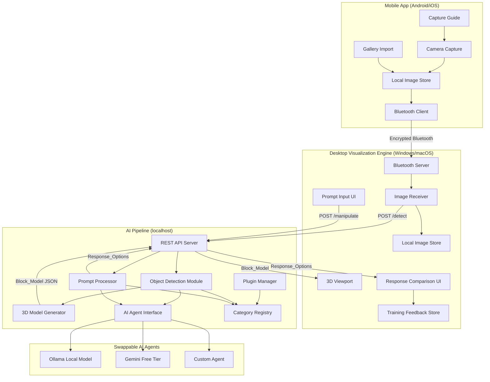
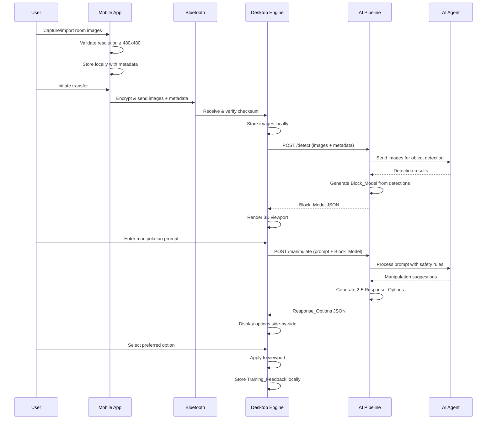

# Design Document — Room Vision AI

## Overview

Room Vision AI is a privacy-first, open-source computer vision system that lets users capture room images on a mobile device, transfer them over encrypted Bluetooth to a desktop application, and generate interactive 3D block-based models with AI-powered room manipulation.

The system is split into three independently developed subsystems:

| Subsystem | Owner | Platform | Language/Framework |
|-----------|-------|----------|--------------------|
| **Mobile App** | Member 1 | Android (Kotlin) / iOS (Swift) | Kotlin Multiplatform or separate native apps |
| **Desktop Visualization Engine** | Member 2 | Windows / macOS | Python + Qt (PySide6) with OpenGL/Vulkan for 3D |
| **AI Pipeline** | Member 3 | Runs on desktop host | Python — exposes a local HTTP API on `localhost` |

Communication between subsystems:

- **Mobile ↔ Desktop**: Encrypted Bluetooth (BLE or Classic), using a versioned JSON protocol.
- **Desktop ↔ AI Pipeline**: Local HTTP REST API on `localhost`. The AI Pipeline runs as a separate process on the same machine as the desktop app.

No data ever leaves the local environment unless the user explicitly configures an external AI agent API.

### Design Decisions and Rationale

1. **Local HTTP for Desktop ↔ AI Pipeline**: Using a localhost REST API (rather than in-process calls) keeps the AI Pipeline independently deployable and language-agnostic. It also makes it trivial to swap AI backends — the desktop app just talks to a local endpoint.

2. **Python + Qt for Desktop**: PySide6 provides cross-platform native UI with strong 3D rendering support via OpenGL. Python aligns with the AI Pipeline's language, simplifying the development environment.

3. **Bluetooth Classic for large transfers, BLE for control**: BLE has low throughput (~1 Mbps practical). Room images at 480×480+ can be several MB. The protocol uses BLE for discovery/pairing and Bluetooth Classic (RFCOMM/L2CAP) for bulk image transfer.

4. **JSON for all serialization**: Every data exchange — Bluetooth protocol messages, Block_Model storage, Training_Feedback, plugin manifests — uses JSON. This keeps the system simple, debuggable, and language-agnostic.

5. **Plugin system via file-based registry**: Plugins are JSON manifest files dropped into a known directory. No package manager, no compilation step. The AI Pipeline scans the plugin directory at startup.

## Architecture

### System Architecture Diagram



### Data Flow Sequence




## Components and Interfaces

### Component 1: Mobile App (Member 1)

**Responsibility**: Image capture, validation, Bluetooth pairing, and encrypted image transfer.

**Internal Modules**:

| Module | Responsibility |
|--------|---------------|
| `CameraCapture` | Opens device camera, captures photos |
| `GalleryImport` | Opens photo gallery/file picker for image selection |
| `ImageValidator` | Validates resolution (≥480×480), format (JPEG/PNG/HEIC) |
| `ImageStore` | Stores validated images locally with metadata |
| `CaptureGuide` | Displays capture instructions, tracks progress, shows diagram |
| `BluetoothClient` | Discovers desktop instances, manages pairing, handles encrypted transfer |
| `TransferManager` | Orchestrates sequential image transfer with progress, checksums, retries |

**Exposed Interface (Bluetooth Protocol)**:

The Mobile App acts as a Bluetooth client. It discovers and connects to the Desktop Visualization Engine's Bluetooth server. All messages use the versioned JSON protocol defined below.

---

### Component 2: Desktop Visualization Engine (Member 2)

**Responsibility**: Bluetooth image reception, 3D model rendering, prompt UI, response comparison, and training feedback storage.

**Internal Modules**:

| Module | Responsibility |
|--------|---------------|
| `BluetoothServer` | Advertises over Bluetooth, accepts pairing, receives encrypted data |
| `ImageReceiver` | Processes received images, verifies checksums, stores locally |
| `AIClient` | HTTP client for AI Pipeline REST API (`/detect`, `/manipulate`, `/health`) |
| `Viewport3D` | OpenGL-based 3D renderer for Block_Model visualization |
| `BlockInspector` | Displays object details (category, confidence, description) on block selection |
| `PromptInput` | Text input field for Manipulation_Prompt entry |
| `ResponseComparison` | Side-by-side display of Response_Options with descriptions |
| `FeedbackStore` | Records, stores, exports, and deletes Training_Feedback as JSON |

**Exposed Interface (to User)**:
- 3D viewport with rotate/zoom/pan
- Block selection → detail panel
- Prompt text input
- Response option cards with "Select" action
- Feedback management (view/export/delete)

---

### Component 3: AI Pipeline (Member 3)

**Responsibility**: Object detection, 3D model generation, prompt processing, plugin management, and AI agent abstraction.

**Internal Modules**:

| Module | Responsibility |
|--------|---------------|
| `APIServer` | FastAPI REST server on `localhost:8321` |
| `ObjectDetector` | Runs object detection via the configured AI agent |
| `ModelGenerator` | Converts detection results into Block_Model geometry |
| `PromptProcessor` | Interprets Manipulation_Prompts, applies safety rules, generates Response_Options |
| `AgentInterface` | Abstract interface for AI agents (Ollama, Gemini, custom) |
| `CategoryRegistry` | Loads and serves Object_Category entries and manipulation rules |
| `PluginManager` | Scans plugin directory, validates manifests, loads plugins at startup |
| `BlockModelSerializer` | Serializes/deserializes Block_Model to/from JSON with schema validation |

---

### Interface Contracts

#### AI Pipeline REST API

**Base URL**: `http://localhost:8321/api/v1`

##### `GET /health`

Health check endpoint.

**Response** `200 OK`:
```json
{
  "status": "ok",
  "agent": "ollama-llava",
  "version": "1.0.0",
  "plugins_loaded": 3
}
```

##### `POST /detect`

Submit images for object detection and 3D model generation.

**Request** (`multipart/form-data`):
```
images[]: binary image files (JPEG/PNG/HEIC)
metadata: JSON string
```

Metadata JSON:
```json
{
  "session_id": "uuid-v4",
  "images": [
    {
      "filename": "wall_north.jpg",
      "format": "jpeg",
      "width": 1920,
      "height": 1080,
      "captured_at": "2025-01-15T10:30:00Z",
      "file_size_bytes": 245760
    }
  ]
}
```

**Response** `200 OK`:
```json
{
  "session_id": "uuid-v4",
  "block_model": { "...see BlockModel schema..." },
  "detection_summary": {
    "total_objects": 23,
    "low_confidence_count": 4,
    "categories_detected": ["light_fixture", "power_outlet", "door", "window"]
  }
}
```

**Response** `422 Unprocessable Entity`:
```json
{
  "error": "insufficient_image_quality",
  "message": "Unable to generate model: images are too blurry for reliable detection.",
  "details": ["wall_north.jpg: motion blur detected"]
}
```

##### `POST /manipulate`

Submit a manipulation prompt with the current Block_Model.

**Request** (`application/json`):
```json
{
  "session_id": "uuid-v4",
  "prompt": "Make this room safer for a toddler",
  "block_model": { "...current BlockModel..." }
}
```

**Response** `200 OK`:
```json
{
  "session_id": "uuid-v4",
  "prompt": "Make this room safer for a toddler",
  "response_options": [
    {
      "option_index": 0,
      "description": "Added outlet covers to 3 exposed outlets, corner guards on coffee table, child gate at stairway entrance.",
      "rules_applied": ["cover_outlets", "corner_guards", "child_gate_stairs"],
      "block_model": { "...modified BlockModel..." }
    },
    {
      "option_index": 1,
      "description": "...",
      "rules_applied": ["..."],
      "block_model": { "..." }
    }
  ]
}
```

##### `GET /categories`

List all registered object categories (core + plugins).

**Response** `200 OK`:
```json
{
  "categories": [
    {
      "id": "power_outlet",
      "label": "Power Outlet",
      "source": "core",
      "safety_tags": ["child_hazard", "electrical"]
    }
  ]
}
```

##### `GET /rules`

List all registered manipulation rules (core + plugins).

**Response** `200 OK`:
```json
{
  "rules": [
    {
      "id": "cover_outlets",
      "label": "Cover Power Outlets",
      "applies_to": ["child_safety"],
      "target_categories": ["power_outlet"],
      "source": "core"
    }
  ]
}
```

---

#### Bluetooth Protocol (Mobile ↔ Desktop)

**Protocol Version**: `1.0`

All Bluetooth messages use a framed JSON envelope:

```json
{
  "protocol_version": "1.0",
  "message_type": "image_transfer | pairing_request | pairing_response | transfer_ack | error",
  "timestamp": "2025-01-15T10:30:00Z",
  "payload": { "...type-specific..." }
}
```

**Message Types**:

| Type | Direction | Purpose |
|------|-----------|---------|
| `pairing_request` | Mobile → Desktop | Initiate pairing |
| `pairing_response` | Desktop → Mobile | Accept/reject pairing |
| `image_transfer` | Mobile → Desktop | Send image data + metadata |
| `transfer_ack` | Desktop → Mobile | Confirm receipt with checksum |
| `error` | Either direction | Report protocol/transfer errors |

**`image_transfer` payload**:
```json
{
  "image_index": 0,
  "total_images": 6,
  "filename": "wall_north.jpg",
  "format": "jpeg",
  "width": 1920,
  "height": 1080,
  "captured_at": "2025-01-15T10:30:00Z",
  "file_size_bytes": 245760,
  "checksum_sha256": "a1b2c3...",
  "data_base64": "...base64-encoded encrypted image bytes..."
}
```

**`transfer_ack` payload**:
```json
{
  "image_index": 0,
  "received_checksum_sha256": "a1b2c3...",
  "status": "ok | checksum_mismatch"
}
```

**Encryption**: All `data_base64` content is AES-256-GCM encrypted. The encryption key is derived during the Bluetooth pairing handshake using ECDH key exchange.

**Version Mismatch Handling**: If a device receives a message with an unrecognized `protocol_version`, it responds with an `error` message:
```json
{
  "protocol_version": "1.0",
  "message_type": "error",
  "timestamp": "...",
  "payload": {
    "error_code": "unsupported_protocol_version",
    "message": "Expected protocol version 1.0, received 2.0",
    "expected_version": "1.0",
    "received_version": "2.0"
  }
}
```

## Data Models

### BlockModel

The central data structure representing a 3D room model. Used for storage, inter-component communication, and rendering.

```json
{
  "model_id": "uuid-v4",
  "created_at": "2025-01-15T10:35:00Z",
  "room_dimensions": {
    "width": 5.0,
    "height": 2.8,
    "depth": 4.0,
    "unit": "meters"
  },
  "blocks": [
    {
      "block_id": "uuid-v4",
      "category": "power_outlet",
      "label": "Power Outlet",
      "description": "Standard dual power outlet on north wall, 30cm above floor level.",
      "confidence_score": 0.87,
      "low_confidence": false,
      "position": { "x": 1.2, "y": 0.3, "z": 0.0 },
      "dimensions": { "width": 0.08, "height": 0.12, "depth": 0.03 },
      "rotation": { "pitch": 0.0, "yaw": 0.0, "roll": 0.0 },
      "source_images": ["wall_north.jpg"],
      "metadata": {}
    }
  ],
  "version": "1.0"
}
```

**Field Constraints**:
- `model_id`: UUID v4, required
- `room_dimensions`: All values > 0, unit is always "meters"
- `blocks[].confidence_score`: Float in range [0.0, 1.0]
- `blocks[].low_confidence`: `true` when `confidence_score < 0.5`
- `blocks[].position`: 3D coordinates relative to room origin (corner)
- `blocks[].dimensions`: All values > 0
- `blocks[].rotation`: Euler angles in degrees
- `blocks[].category`: Must exist in the Category_Registry
- `version`: Semantic version string matching the schema version

### ImageMetadata

Metadata attached to each captured/imported image.

```json
{
  "filename": "wall_north.jpg",
  "format": "jpeg",
  "width": 1920,
  "height": 1080,
  "captured_at": "2025-01-15T10:30:00Z",
  "file_size_bytes": 245760
}
```

**Field Constraints**:
- `format`: One of `"jpeg"`, `"png"`, `"heic"`
- `width`, `height`: Integers ≥ 480
- `file_size_bytes`: Integer > 0

### DetectionResult

Output from the object detection module for a single image.

```json
{
  "image_filename": "wall_north.jpg",
  "detections": [
    {
      "category": "power_outlet",
      "confidence_score": 0.87,
      "bounding_box": {
        "x_min": 120,
        "y_min": 450,
        "x_max": 180,
        "y_max": 530
      }
    }
  ]
}
```

### ResponseOption

A single manipulation response generated by the AI Pipeline.

```json
{
  "option_index": 0,
  "description": "Added outlet covers to 3 exposed outlets, corner guards on coffee table.",
  "rules_applied": ["cover_outlets", "corner_guards"],
  "block_model": { "...modified BlockModel..." }
}
```

### TrainingFeedback

Recorded when the user selects (or dismisses) response options.

```json
{
  "feedback_id": "uuid-v4",
  "session_id": "uuid-v4",
  "created_at": "2025-01-15T10:45:00Z",
  "prompt": "Make this room safer for a toddler",
  "original_block_model_id": "uuid-v4",
  "response_options": [
    {
      "option_index": 0,
      "description": "...",
      "rules_applied": ["..."],
      "block_model_id": "uuid-v4"
    }
  ],
  "selected_option_index": 0,
  "dismissed": false
}
```

**Field Constraints**:
- `selected_option_index`: Integer ≥ 0, or `null` if `dismissed` is `true`
- `dismissed`: `true` when user dismisses all options without selecting

### PluginManifest

Defines a plugin's contributions to the system.

```json
{
  "plugin_id": "child-safety-extended",
  "name": "Extended Child Safety Rules",
  "version": "1.0.0",
  "author": "Community Contributor",
  "categories": [
    {
      "id": "baby_monitor",
      "label": "Baby Monitor",
      "safety_tags": ["child_safety", "electronic"]
    }
  ],
  "rules": [
    {
      "id": "secure_baby_monitor",
      "label": "Secure Baby Monitor Placement",
      "applies_to": ["child_safety"],
      "target_categories": ["baby_monitor"]
    }
  ],
  "prompt_types": [],
  "agent_config": null
}
```

### AgentConfig

Configuration for swapping AI agents.

```json
{
  "agent_type": "ollama",
  "model_name": "llava:13b",
  "endpoint": "http://localhost:11434",
  "api_key": null,
  "timeout_seconds": 120,
  "max_retries": 2
}
```

Supported `agent_type` values: `"ollama"`, `"gemini"`, `"custom"`. For `"custom"`, the user implements the `AgentInterface` and provides the module path.

### AI Agent Interface

The abstract interface that all AI agents must implement:

```python
from abc import ABC, abstractmethod
from typing import List

class AgentInterface(ABC):
    """Abstract interface for swappable AI agents."""

    @abstractmethod
    def detect_objects(self, images: List[bytes], metadata: List[dict]) -> List[dict]:
        """
        Detect objects in room images.
        
        Args:
            images: List of raw image bytes
            metadata: List of ImageMetadata dicts
            
        Returns:
            List of DetectionResult dicts
        """
        pass

    @abstractmethod
    def generate_manipulation(
        self, prompt: str, block_model: dict, rules: List[dict]
    ) -> List[dict]:
        """
        Generate 2-5 response options for a manipulation prompt.
        
        Args:
            prompt: Natural language manipulation prompt
            block_model: Current BlockModel dict
            rules: Applicable manipulation rules from Category_Registry
            
        Returns:
            List of ResponseOption dicts (2-5 items)
        """
        pass

    @abstractmethod
    def health_check(self) -> dict:
        """Return agent status information."""
        pass
```

### Category Registry Schema

The Category_Registry is loaded from a combination of core definitions and plugin contributions:

```
plugins/
├── core/
│   ├── categories.json      # Built-in object categories
│   └── rules.json           # Built-in manipulation rules
├── installed/
│   ├── child-safety-extended/
│   │   └── manifest.json    # PluginManifest
│   └── elderly-accessibility/
│       └── manifest.json
```

At startup, the PluginManager:
1. Loads `core/categories.json` and `core/rules.json`
2. Scans `installed/` for `manifest.json` files
3. Validates each manifest against the PluginManifest schema
4. Merges plugin categories and rules into the registry
5. Reports any validation errors without crashing (skip invalid plugins)
